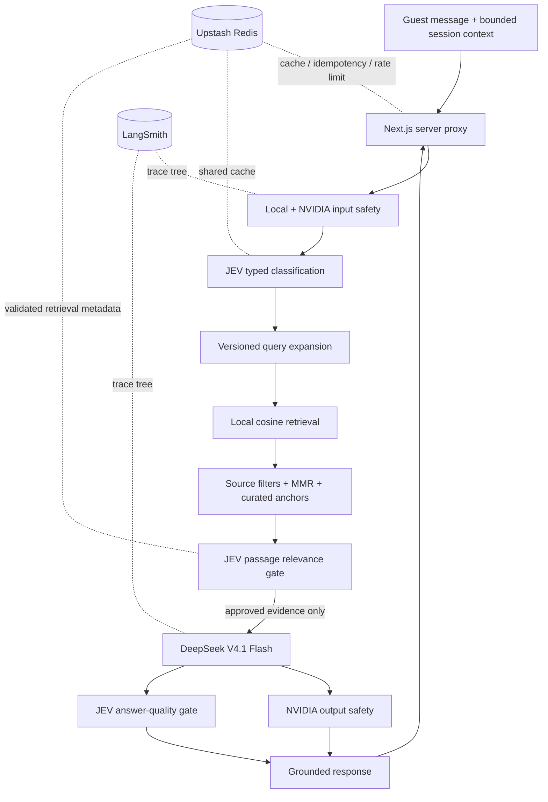

# Gita Guide

> A decision-first, source-grounded AI companion for reflective guidance from the Bhagavad Gita.

Gita Guide turns a human message such as _“I had an argument with my wife and I feel lost”_ into concise, practical guidance that is traceable to specific passages. It does not ask one language model to improvise wisdom and grade its own work. Classification, retrieval, generation, safety, and answer validation are separate stages with explicit contracts and fail-closed boundaries.

The result is a guest-first chat experience that feels gentle on the surface and behaves like a carefully engineered retrieval system underneath.

## Why this project is different

Most RAG demos stop after vector search and generation. Gita Guide treats those as only two steps in a larger evidence pipeline:

- **Decision-first understanding.** JEV converts an open-ended message into typed situation, emotion, root-conflict, and Gita-trait decisions with confidence. Narrow deterministic intent expansions also protect short reflective questions from a single uncertain scope decision.
- **A provenance-checked local corpus.** The repository ships verse-aware chunks and a precomputed embedding matrix; runtime search does not depend on a hosted vector database.
- **Evidence must earn its way into the prompt.** Dense retrieval, curated anchors, MMR diversity, source filters, and an independent JEV relevance decision all run before generation.
- **The generator is not the judge.** DeepSeek writes the response; JEV independently checks faithfulness, citation coverage, helpfulness, and user agency.
- **Safety surrounds generation.** Local checks and NVIDIA content-safety rails run at the input and output boundaries.
- **Conversation memory preserves emotional movement.** A bounded rolling summary and recent turns let the guide recognize transitions such as “I was sad; now I feel hopeful” without storing a user account or durable chat history.
- **Failure is a product state.** Weak evidence is rejected instead of stretched. The web app can disclose and serve a curated offline reflection rather than returning invented guidance.
- **Every request is diagnosable.** Request IDs correlate structured logs, provider calls, cache events, audit records, and LangSmith traces without putting raw messages in ordinary logs.

## Architecture



The Python API remains stateless. The browser sends a bounded conversation summary and recent complete turns with each request, then replaces its in-memory context with the server’s returned state. Refreshing the page clears the conversation.

## Our custom RAG pipeline

Gita Guide does not delegate retrieval to a generic vector-database wrapper. Its RAG pipeline is built specifically around scripture provenance, verse boundaries, speaker attribution, and the difference between finding a semantically similar passage and finding one that can safely ground advice.

### 1. Build a verifiable corpus

The ingestion pipeline reads the source edition recorded in `data/sources.json`, verifies its SHA-256 checksum, and produces stable, verse-aware chunks. Every chunk carries a source ID, chapter and verse range, speaker, section type, author attribution, source page, and readable Sanskrit sloka where available.

The processed corpus contains 1,860 chunks covering all 700 verses: 653 translation chunks and 1,207 commentary chunks. Translation and commentary remain explicitly separated so commentary cannot accidentally be presented as Krishna’s direct speech.

Passage embeddings are generated offline with `nvidia/nemotron-3-embed-1b`, normalized, checksummed, and committed as a 2,048-dimensional NumPy matrix. At startup the retriever verifies the corpus checksum, vector checksum, row count, dimensionality, and normalization before serving traffic.

### 2. Understand before searching

The retrieval query is more than the last user sentence. It combines:

- the current message, which always remains authoritative;
- bounded prior conversation context when it changes the meaning of the request;
- only high-confidence JEV classifications;
- a versioned mapping from everyday situations to vocabulary used by the Gita corpus;
- narrow message-intent expansions for underspecified questions such as “what makes a person perfect?” or “how can I improve my skill?”

Low-confidence fields are omitted instead of contaminating the query. This is important for short human messages, where one incorrect label can otherwise dominate dense retrieval.

### 3. Retrieve locally, then diversify

At runtime NVIDIA produces only the query embedding. Cosine similarity against the bundled matrix runs locally with NumPy, removing a vector-database network hop and keeping the exact ranking implementation under test.

The pipeline then:

1. restricts candidates to the approved source, translation sections, and Krishna as speaker;
2. retrieves 20 dense candidates;
3. injects curated trait and situation anchors as candidates—not automatic winners;
4. applies maximal marginal relevance;
5. limits chapter concentration so one thematic cluster does not crowd out alternatives.

Curated anchors solve a real semantic-search weakness: a short phrase such as “argument with my wife” may not resemble ancient wording about kind conduct or non-offending speech. Anchors guarantee that those passages are considered, but they still have to pass the same independent validation as every other result.

### 4. Validate evidence before generation

The five best diverse candidates go to JEV in one typed decision request. For each passage, JEV answers two separate questions:

- Does this passage directly address a specific part of the user’s situation, emotion, or inner conflict?
- Can an answer use the principle actually stated in the passage without inventing a teaching or stretching a metaphor?

Only candidates above the configured relevance threshold survive. At most three approved passages cross the typed generation boundary. If none survive, DeepSeek is never called.

### 5. Generate from a closed evidence set

DeepSeek receives the user context, typed classification, and only the approved passages. It must use supplied citation labels, follow a stable two-section response format, and avoid diagnosis, coercion, shame, fabricated verses, or claims of divine authority.

After generation, deterministic citation checks, NVIDIA output safety, and JEV answer validation run before the response reaches the user. A helpfulness-only failure can receive a bounded repair; grounding or safety failures are never papered over with another unconstrained draft.

### 6. Cache decisions without hiding invalidation

Redis cache identities include the corpus checksum, embedding model, taxonomy, prompt versions, thresholds, filters, and reranking settings. Changing anything that could change a decision creates a new cache generation automatically. Retrieval values store approved chunk IDs and scores rather than user queries or verse text; the application rehydrates content from the verified local corpus.

This custom approach is intentionally small and inspectable. For 1,860 chunks, local cosine search is simpler, cheaper, and more deterministic than operating a remote vector database—and the independent evidence gate is more valuable than adding retrieval infrastructure.

Key implementation entry points:

- `scripts/ingest_gita_pdf.py` — provenance-aware chunk construction;
- `scripts/embed_gita_chunks.py` — reproducible passage embeddings;
- `app/retrieval/gita_vector_retriever.py` — query construction, cosine search, and MMR;
- `app/retrieval/trait_anchors.py` — curated candidate coverage;
- `app/retrieval/jev_relevance_validator.py` — typed evidence decisions;
- `app/services/retrieval_service.py` — filters, cache identity, and orchestration;
- `app/services/generation_service.py` — closed-context generation and answer gates.

## Why these technologies

### JEV: decisions, not prose

[JEV](https://openrouter.ai/typesafe/jev-1.13) is used where the system needs a constrained decision rather than creative text:

1. classify scope, situation, emotion, inner conflict, and fine-grained trait;
2. decide whether each retrieved passage is genuinely relevant and groundable;
3. evaluate the final answer for faithfulness, citation coverage, helpfulness, and agency.

This separation matters. A fluent generator can rationalize a weak retrieval result. JEV gives the application typed probabilities and explicit acceptance thresholds, so uncertainty becomes code—not an adjective hidden in model prose.

### DeepSeek V4.1 Flash: focused text generation

`deepseek/deepseek-v4.1-flash` is the default generator through OpenRouter. It is used for what it is good at: turning a small set of approved passages into a clear, empathetic, text-to-text response under a strict format.

It is intentionally _not_ trusted to choose its own evidence or approve its own answer. The model sits between independent retrieval and validation gates, can receive a bounded repair instruction, and can be replaced through one environment variable. Model changes belong behind the evaluation suite, not inside product assumptions.

### Redis: serverless coordination, not conversation storage

Vercel instances are ephemeral and horizontally scaled. Upstash Redis supplies the shared state that must survive individual function instances:

- HMAC-keyed classification and validated-retrieval caches;
- atomic idempotency claims for repeated requests;
- guest rate limiting at the Next.js boundary.

Raw user text is not used as a Redis key. Retrieval cache values contain approved chunk identifiers and scores, then rehydrate verse text from the checked local corpus. Conversation history is deliberately not persisted in Redis.

### LangSmith: see the system, not just the final sentence

LangSmith captures the LangChain execution tree: safety, classification, retrieval, each generation attempt, repairs, and final validation. Combined with the application request ID, this makes latency and quality failures explainable across provider boundaries.

LangSmith is observability—not the authoritative audit store. Tracing should be enabled only under an appropriate privacy and retention policy because model traces can contain user content.

## The request lifecycle

1. Validate input length and normalize the current message.
2. Run deterministic local safety rules and the NVIDIA input rail.
3. Ask JEV for typed classification decisions.
4. Build a retrieval query using only confident fields plus versioned Gita vocabulary.
5. Embed the query with NVIDIA Nemotron and search 1,860 local corpus chunks.
6. Filter to approved source translations spoken by Krishna, inject curated candidates, and apply maximal marginal relevance.
7. Ask JEV to accept or reject up to five candidate passages.
8. Give at most three approved passages to DeepSeek.
9. Run output safety and final JEV quality validation concurrently.
10. Return cited guidance and the next bounded conversation-memory state—or fail closed.

## Technology stack

| Layer | Technology | Responsibility |
| --- | --- | --- |
| Web | Next.js 16, React 19, TypeScript | Guest chat, in-page memory, server-side proxy |
| API | FastAPI, Pydantic | Typed ingress, lifecycle, error contracts |
| Orchestration | LangChain | Named, testable pipeline stages |
| Decisions | JEV via OpenRouter | Classification and independent quality gates |
| Generation | DeepSeek V4.1 Flash via OpenRouter | Grounded response composition |
| Safety and embeddings | NVIDIA Nemotron | Input/output safety and query embeddings |
| Retrieval | NumPy cosine search + MMR | Local search over bundled vectors |
| Shared state | Upstash Redis | Cache, idempotency, guest rate limits |
| Observability | JSON logs, Prometheus, LangSmith | Correlated operations and model traces |
| Hosting | Vercel | Two projects from one repository |

## Repository layout

```text
.
├── app/
│   ├── api/                    # FastAPI routes, middleware, lifecycle
│   ├── classifiers/            # JEV contracts and Gita taxonomy
│   ├── guardrails/             # Local and NVIDIA safety boundaries
│   ├── retrieval/              # Local vector search and JEV passage validation
│   ├── services/               # Classification, retrieval, generation, memory
│   └── observability/          # Logs, metrics, audit events
├── data/
│   ├── processed/              # Verse chunks, checksummed vectors, metadata
│   └── sources.json            # Source provenance and checksum
├── evals/                      # Classification, retrieval, answer, adversarial gates
├── tests/                      # Deterministic backend contract tests
├── web/                        # Next.js guest application
├── index.py                    # Vercel FastAPI entrypoint
└── vercel.json                 # Backend function bundle and duration
```

## Run locally

### Prerequisites

- Python 3.10+
- Node.js 20+
- OpenRouter API key with JEV and DeepSeek access
- NVIDIA API key
- Optional for local development: Upstash and LangSmith

### 1. Start the API

```bash
python3 -m venv .venv
source .venv/bin/activate
python -m pip install -r requirements.txt
cp .env.example .env
```

The checked-in template already uses safe local defaults. Add real
`OPENROUTER_API_KEY` and `NVIDIA_API_KEY` values. Keep LangSmith tracing disabled
unless `LANGSMITH_API_KEY` contains a valid key, and make sure the frontend uses
the same `APP_API_KEY` value.

```bash
uvicorn index:app --host 127.0.0.1 --port 8000
```

Health endpoints:

```bash
curl http://127.0.0.1:8000/health/live
curl http://127.0.0.1:8000/health/ready
```

### 2. Start the web app

```bash
cd web
npm ci
cp .env.example .env.local
npm run dev
```

For local use, set `BACKEND_API_URL=http://127.0.0.1:8000` and use the same `APP_API_KEY` as the backend. Missing Upstash guest-rate-limit values are allowed only when Next.js is not running in production mode.

Open [http://localhost:3000](http://localhost:3000).

## Deploy to Vercel

This repository is intentionally deployed as **two Vercel projects from the same Git repository**. Vercel documents this as the standard monorepo model: one project per root directory.

| Vercel project | Root directory | Environment template |
| --- | --- | --- |
| `gita-guide-api` | `.` | [`.env.example`](.env.example) |
| `gita-guide-web` | `web` | [`web/.env.example`](web/.env.example) |

### Backend project

1. Import the repository into Vercel.
2. Keep the root directory at the repository root.
3. Vercel detects the FastAPI entrypoint exported by `index.py`.
4. Add every variable from `.env.example` to Preview and Production, using real
   provider and Redis credentials.
5. Apply the production overrides shown below.
6. Mark API keys, tokens, and HMAC secrets as **Sensitive**.
7. Deploy and verify `/health/live` and `/health/ready`.

```dotenv
APP_ENVIRONMENT=production
NVIDIA_GUARDRAIL_REQUIRED=true
CACHE_BACKEND=upstash
AUDIT_LOG_PATH=/tmp/gita-guide/phase1.jsonl
LANGSMITH_TRACING=true
```

Set `LANGSMITH_TRACING=false` in production if no valid LangSmith key is configured.

The backend `vercel.json` bundles the checksummed corpus and embedding artifacts and gives the function a 120-second ceiling. The deployed API is protected by `APP_API_KEY`; browser code never receives that key.

### Frontend project

1. Import the same repository a second time.
2. In **Settings → Build and Deployment**, set **Root Directory** to `web`.
3. Set **Framework Preset** to **Next.js**. Do not reuse the FastAPI backend project.
4. Leave Build Command and Output Directory on their framework defaults.
5. Add the five variables from `web/.env.example`.
6. Set `BACKEND_API_URL` to the deployed backend origin.
7. Set `APP_API_KEY` to exactly the backend value.
8. Deploy, submit a guest message, and correlate its `X-Request-ID` across both projects.

The frontend contains its own `web/vercel.json` with `"framework": "nextjs"`.
If a frontend build reports “No FastAPI entrypoint found,” Vercel is still building
the repository root or the project Framework Preset is still set to FastAPI.

Do not create `NEXT_PUBLIC_*` versions of any secret. Vercel environment changes apply only to new deployments, so redeploy after changing a value. See the [Vercel monorepo guide](https://vercel.com/docs/monorepos), [FastAPI guide](https://vercel.com/docs/frameworks/backend/fastapi), and [sensitive environment-variable guide](https://vercel.com/docs/environment-variables/sensitive-environment-variables).

### Production smoke test

```bash
curl -i https://YOUR_API_HOST/health/live

curl -i https://YOUR_API_HOST/v1/guidance \
  -H 'Content-Type: application/json' \
  -H 'X-API-Key: YOUR_SERVER_ONLY_KEY' \
  -H 'Idempotency-Key: deployment-smoke-001' \
  --data '{"message":"I am anxious about an outcome I cannot control.","conversation":{}}'
```

Keep `GUIDANCE_RELEASE_APPROVED=false` until the full evaluation manifest is reviewed. The current guest deployment uses the explicit private-beta gate.

## Environment design

Only deployment-critical values remain in the templates. Timeouts, thresholds, retrieval sizes, cache TTLs, and conversation-memory limits have validated application defaults and should not be copied into every environment unless an evaluated change requires an override.

Generate independent secrets:

```bash
openssl rand -hex 32  # APP_API_KEY
openssl rand -hex 32  # CACHE_HMAC_SECRET
openssl rand -hex 32  # PROMPT_FINGERPRINT_SECRET
openssl rand -hex 32  # GUEST_RATE_LIMIT_SECRET
```

Never reuse the guest-rate-limit secret as a cache or prompt-fingerprint secret.

## API

The primary endpoint is `POST /v1/guidance`. The browser calls `POST /api/chat` on the Next.js application; that server-only route adds the private backend credential, idempotency, rate limiting, and bounded conversation context before contacting FastAPI. There is no end-user sign-in flow.

The API returns:

- server-generated request ID;
- cited guidance and structured presentation fields;
- grounded corpus chunk IDs;
- resolved generation and validation models;
- JEV probabilities for faithfulness, citation coverage, helpfulness, and agency;
- the next bounded conversation summary and recent-turn window.

Additional endpoints:

| Method | Path | Purpose |
| --- | --- | --- |
| `GET` | `/health/live` | Process liveness |
| `GET` | `/health/ready` | Dependency readiness |
| `POST` | `/v1/classifications` | Typed JEV classification |
| `POST` | `/v1/guidance` | Full grounded pipeline |
| `POST` | `/v1/conversations/summarize` | Bounded memory compaction |
| `GET` | `/metrics` | Prometheus metrics, API-key protected |

## Quality gates

Deterministic checks:

```bash
PYTHONPATH=. .venv/bin/python -m pytest -q
cd web && npm test && npm run build
```

Live evaluation suites make provider calls and may consume quota:

```bash
python -m evals.run_classification_evals
python -m evals.run_retrieval_evals
python -m evals.run_grounded_answer_evals
python -m evals.run_adversarial_evals
```

The evaluation data includes ambiguity, abstention, prompt-injection, emotional-transition, relationship-conflict, evidence-grounding, and citation cases. A model or prompt change is not “better” merely because it is faster; it must pass the relevant quality gates.

## Privacy, safety, and honest limitations

- This is reflective guidance, not therapy, diagnosis, emergency support, or a substitute for human judgment.
- Guest conversations live in page memory and disappear on refresh, but configured model and tracing providers still process request content under their own policies.
- Raw message content is excluded from normal application logs by default. LangSmith traces can contain inputs and outputs.
- The Vercel-compatible JSONL audit path uses ephemeral `/tmp`; it is a private-beta compatibility measure, not durable compliance storage.
- Hosted provider availability and rate limits remain external dependencies.
- The bundled source edition and derived corpus have recorded provenance in `data/sources.json`. Confirm redistribution rights before publicly distributing source or derived text.

---

Gita Guide is designed around a simple principle: **a compassionate answer should still be an auditable answer.**
